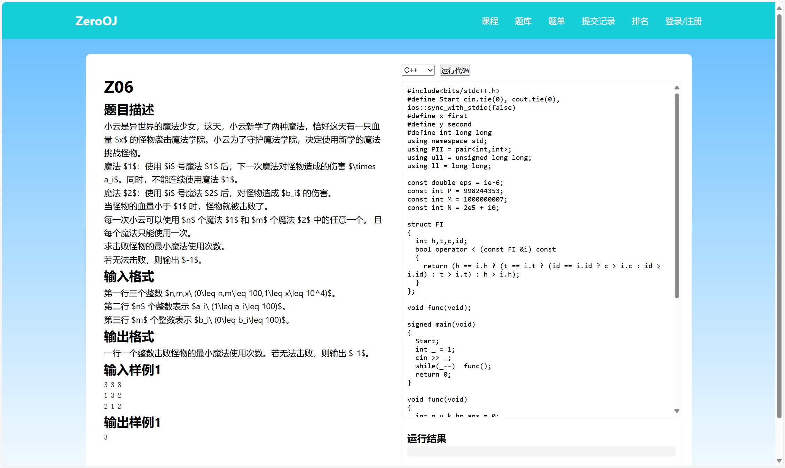

### 25/3/27
上传 `github`。
#### 实现内容
- 全局
    - 页头
    - 侧边公告栏
- 首页
    
    - 图片滚动
- 课程页
    
    - 大致结构，还未填入内容，拿白板随便搞了三张图。

### 25/3/28
#### 计划
- 三天内做完题单页，并把本地的题库上传。
> 全是改编题，不知道会不会有事，我先传个十道，之后再看着改。

### 25/3/30
#### 实现内容
- 题库
    
    - 题目展示
    - 题目跳转
- 题目
    
    - 题目展示
    - 代码书写
#### 待实现
- 题库
    - 通过率展示
    - 题目`tag`
    - 余下 $90$ 题上传
- 题目
    - $\TeX$ 公式转换
    - 代码高亮
    - 代码模板
    - 接入后端判题
    - 在线运行代码
#### 计划
继续开发后端判题机与用户管理系统。

将项目改用 `vue` 实现

### 25/4/1
- 判题机
    - 将一一对应的判题机上传。
    - 需要限制运行速度，现在 1s 可以跑 $10^{10}$ 次不止。
